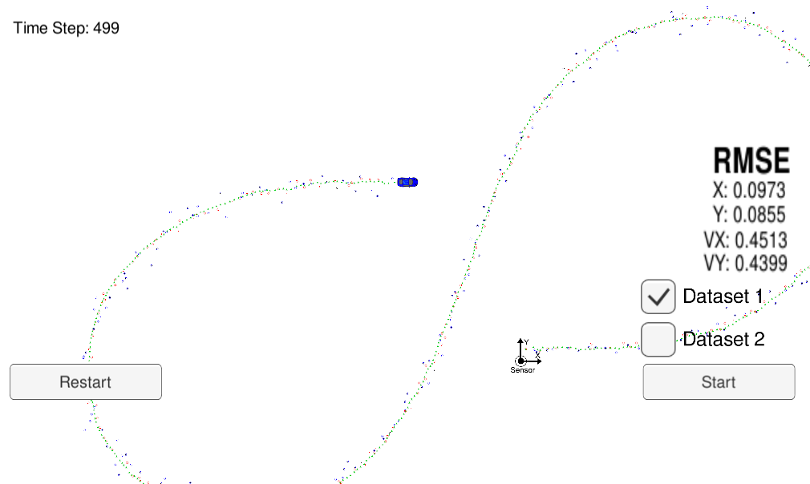
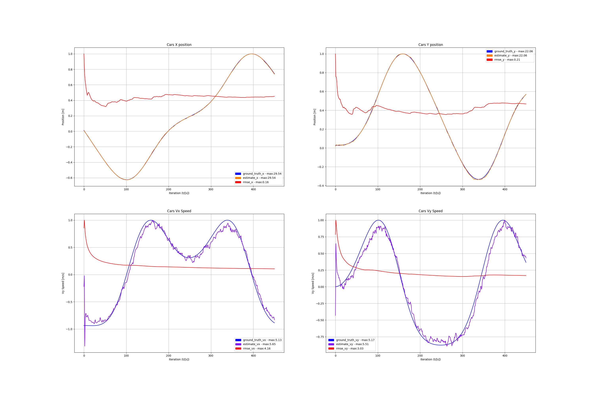

<!-- 
**********************************************************************
https://review.udacity.com/#!/rubrics/1962/view

Project Specification
CarND-P5-Extended_Kalman_Filters

Required Files
    (OK) - 1 - Your code should compile.: Code must compile without errors with cmake and make. Given that we've made CMakeLists.txt as general as possible, it's recommended that you do not change it unless you can guarantee that your changes will still compile on any platform.
    
    (OK) - 2 - px, py, vx, vy output coordinates must have an RMSE <= [.11, .11, 0.52, 0.52] when using the file: "obj_pose-laser-radar-synthetic-input.txt" which is the same data file the simulator uses for Dataset 1: Your algorithm will be run against Dataset 1 in the simulator which is the same as "data/obj_pose-laser-radar-synthetic-input.txt" in the repository. We'll collect the positions that your algorithm outputs and compare them to ground truth data. Your px, py, vx, and vy RMSE should be less than or equal to the values [.11, .11, 0.52, 0.52]. 
    
    (OK) - 3 - Your Sensor Fusion algorithm follows the general processing flow as taught in the preceding lessons.: While you may be creative with your implementation, there is a well-defined set of steps that must take place in order to successfully build a Kalman Filter. As such, your project should follow the algorithm as described in the preceding lesson.
    
    (OK) - 4 - Your Kalman Filter algorithm handles the first measurements appropriately: Your algorithm should use the first measurements to initialize the state vectors and covariance matrices.
    
    (OK) - 5 - Your Kalman Filter algorithm first predicts then updates: Upon receiving a measurement after the first, the algorithm should predict object position to the current timestep and then update the prediction using the new measurement.
    
    (OK) - 6 - Your Kalman Filter can handle radar and lidar measurements: Your algorithm sets up the appropriate matrices given the type of measurement and calls the correct measurement function for a given sensor type.

Code Efficiency
    (OK) - 7 - Your algorithm should avoid unnecessary calculations: This is mostly a "code smell" test. Your algorithm does not need to sacrifice comprehension, stability, robustness or security for speed, however it should maintain good practice with respect to calculations. Here are some things to avoid. This is not a complete list, but rather a few examples of inefficiencies:

        * Running the exact same calculation repeatedly when you can run it once, store the value and then reuse the value later.
        * Loops that run too many times.
        * Creating unnecessarily complex data structures when simpler structures work equivalently.
        * Unnecessary control flow checks.

Suggestions to Make Your Project Stand Out!
    There are two ways we think you could make your project stand out:

    (OK) - 1. While we're giving this project to you with starter code, you are not actually required to use it! If you think you can organize your Kalman Filter better than us, go for it! Also, this project was templatized in an object-oriented style, however it's reasonable to build a Kalman Filter in a functional style. Feel free to start from scratch with a functional algorithm!
        
        * Keep in mind that your code must compile. If your changes necessitate modifying CMakeLists.txt, you are responsible for ensuring that any reviewer can still compile your code given the dependencies listed earlier in the instructions - platform specific errors will not be debugged by graders.

    (OK) - 2. There is some room for improvement with the Kalman Filter algorithm. Maybe some aspects of the algorithm could be combined? Maybe some could be skipped under certain circumstances? Maybe there are other ways to improve performance? Get creative!

    (OK) - 3. Analyze what happens when you turn off radar or lidar. Which sensor type provides more accurate readings? How does fusing the two sensors' data improve the tracking results?

**********************************************************************
-->

# CarND-P5-Extended_Kalman_Filters
[](http://www.udacity.com/drive)

 

## Overview

In this project I utilized a kalman filter codec in C++ to estimate the state of a moving object of interest with noisy lidar and radar measurements. The project required obtaining RMSE values that are lower than the tolerance outlined in the [project rubric](https://review.udacity.com/#!/rubrics/1962/view). 

---
## Overview of a Kalman Filter: Initialize, Predict, Update

To review the extended Kalman filters, let's discuss the three main steps for programming a Kalman filter:

* Initializing Kalman filter variables
* Predicting where the object is going to be after a time step Δt
* Updating where the object is based on sensor measurements

Then the prediction and update steps repeat themselves in a loop.

To measure how well the Kalman filter performs, The root mean squared error is calculated comparing the Kalman filter results with the provided ground truth.

These three steps (initialize, predict, update) plus calculating RMSE encapsulate the entire extended Kalman filter project.

---
## Files in the Github src Folder:

The files you need to work with are in the src folder of the github repository.

* [main.cpp](https://github.com/JohnBetaCode/CarND-P5-Extended_Kalman_Filters/blob/master/src/main.cpp) - communicates with the Term 2 Simulator receiving data measurements, calls a function to run the Kalman filter, calls a function to calculate RMSE
* [FusionEKF.cpp](https://github.com/JohnBetaCode/CarND-P5-Extended_Kalman_Filters/blob/master/src/FusionEKF.cpp) - initializes the filter, calls the predict function, calls the update function
* [kalman_filter.cpp](https://github.com/JohnBetaCode/CarND-P5-Extended_Kalman_Filters/blob/master/src/kalman_filter.cpp) - defines the predict function, the update function for lidar, and the update function for radar
* [tools.cpp](https://github.com/JohnBetaCode/CarND-P5-Extended_Kalman_Filters/blob/master/src/tools.cpp) - function to calculate RMSE and the Jacobian matrix

Here is a brief overview of what happens when the code files are executed:

* Main.cpp reads in the data and sends a sensor measurement to FusionEKF.cpp
* FusionEKF.cpp takes the sensor data and initializes variables and updates variables. The Kalman filter equations are not in this file. FusionEKF.cpp has a variable called ekf_, which is an instance of a KalmanFilter class. The ekf_ will hold the matrix and vector values. The ekf_ instance is called the predict and update equations.
* The KalmanFilter class is defined in kalman_filter.cpp and kalman_filter.h, which contains functions for the prediction and update steps.

---
## Results (Rubric)
  
The Sensor Fusion algorithm follows the general processing flow as taught in the preceding lessons: [kalman_filter.cpp](https://github.com/JohnBetaCode/CarND-P5-Extended_Kalman_Filters/blob/master/src/kalman_filter.cpp) and [FusionEKF.cpp](https://github.com/JohnBetaCode/CarND-P5-Extended_Kalman_Filters/blob/master/src/FusionEKF.cpp)

The Kalman Filter algorithm handles the first measurements appropriately and uses it to initialize the state vectors and covariance matrices: [FusionEKF.cpp](https://github.com/JohnBetaCode/CarND-P5-Extended_Kalman_Filters/blob/master/src/FusionEKF.cpp)
from line 35 to 72 and from line 82 to 130.

The Kalman Filter algorithm first predicts and then updates: Upon receiving a measurement after the first, the algorithm predicts object position to the current timestep and then update the prediction using the new measurement: [FusionEKF.cpp](https://github.com/JohnBetaCode/CarND-P5-Extended_Kalman_Filters/blob/master/src/FusionEKF.cpp) from line 143 to 169.

The Kalman Filter can handle the radar and lidar measurements: the algorithm sets up the appropriate matrices given the type of measurement and calls the correct measurement function for a given sensor type: [FusionEKF.cpp](https://github.com/JohnBetaCode/CarND-P5-Extended_Kalman_Filters/blob/master/src/FusionEKF.cpp) from line 180 to 194.

### Results:  

The px, py, vx, vy output coordinates have an RMSE <= [.11, .11, 0.52, 0.52] when using the file: "obj_pose-laser-radar-synthetic-input.txt" which is the same data file the simulator uses for Dataset 1: the algorithm run against Dataset 1 in the simulator which is the same as "data/obj_pose-laser-radar-synthetic-input.txt" in the repository. The positions that the algorithm outputs are collected and compare them with the ground truth data. The px, py, vx, and vy RMSE is less than the values [.11, .11, 0.52, 0.52] specified in the project rubrics. 

Dataset 1:

  
 
 

[CarND-P5-Extended_Kalman_Filters-Dataset_1](https://youtu.be/9A-hHT5xxDs)  

Dataset 2:

  
  
 

[CarND-P5-Extended_Kalman_Filters-Dataset_2](https://youtu.be/7dkAgI7CL6M)

---
## Dependencies

This project involves the Term 2 Simulator which can be downloaded [here](https://github.com/udacity/self-driving-car-sim/releases).

This repository includes two files that can be used to set up and install [uWebSocketIO](https://github.com/uWebSockets/uWebSockets) for either Linux or Mac systems. For windows you can use either Docker, VMware, or even [Windows 10 Bash on Ubuntu](https://www.howtogeek.com/249966/how-to-install-and-use-the-linux-bash-shell-on-windows-10/) to install uWebSocketIO. Please see the uWebSocketIO Starter Guide page in the classroom within the EKF Project lesson for the required version and installation scripts.

Once the install for uWebSocketIO is complete, the main program can be built and run by doing the following from the project top directory.

1. mkdir build
2. cd build
3. cmake ..
4. make
5. ./ExtendedKF

Tips for setting up your environment can be found in the classroom lesson for this project.

Note that the programs that need to be written to accomplish the project are src/FusionEKF.cpp, src/FusionEKF.h, kalman_filter.cpp, kalman_filter.h, tools.cpp, and tools.h

The program main.cpp has already been filled out, but feel free to modify it.

Here is the main protocol that main.cpp uses for uWebSocketIO in communicating with the simulator.

INPUT: values provided by the simulator to the c++ program

        ["sensor_measurement"] => the measurement that the simulator observed (either lidar or radar)

OUTPUT: values provided by the c++ program to the simulator

        ["estimate_x"] <= kalman filter estimated position x  
        ["estimate_y"] <= kalman filter estimated position y  
        ["rmse_x"]  
        ["rmse_y"]  
        ["rmse_vx"]  
        ["rmse_vy"]  

---
## Other Important Dependencies

* cmake >= 3.5
  * All OSes: [click here for installation instructions](https://cmake.org/install/)
* make >= 4.1 (Linux, Mac), 3.81 (Windows)
  * Linux: make is installed by default on most Linux distros
  * Mac: [install Xcode command line tools to get make](https://developer.apple.com/xcode/features/)
  * Windows: [Click here for installation instructions](http://gnuwin32.sourceforge.net/packages/make.htm)
* gcc/g++ >= 5.4
  * Linux: gcc / g++ is installed by default on most Linux distros
  * Mac: same deal as make - [install Xcode command line tools](https://developer.apple.com/xcode/features/)
  * Windows: recommend using [MinGW](http://www.mingw.org/)

---
## Basic Build Instructions

1. Clone the [CarND-P5-Extended_Kalman_Filters](https://github.com/JohnBetaCode/CarND-P5-Extended_Kalman_Filters) repo.
2. Make a build directory: `mkdir build && cd build`
3. Compile: `cmake .. && make` 
   * On windows, you may need to run: `cmake .. -G "Unix Makefiles" && make`
4. Run it: `./ExtendedKF `
5. After this you just can run the script to build and run all: 
    ```
    clear && python3 CarND-P5-Extended_Kalman_Filters.py
    ```
Yes, I know, making a build with a python script is horrible, I'm a bad person but too lazy as well to write the make line every time that I changed something in my code, dont judge me. This script also run everything for you. If you want to plot the Kalman Filter's response just wait until the car finish its path, in this way the c++ code close the csv file to plot the results later with matplotlib in the python code. 

---
## Data File for EKF project

The github repo contains one data file:

* obj_pose-laser-radar-synthetic-input.txt

Here is a screenshot of the first data file:

The simulator will be using this data file, and feed main.cpp values from it one line at a time.

 

Each row represents a sensor measurement where the first column tells if the measurement comes from radar (R) or lidar (L).

For a row containing radar data, the columns are: sensor_type, rho_measured, phi_measured, rhodot_measured, timestamp, x_groundtruth, y_groundtruth, vx_groundtruth, vy_groundtruth, yaw_groundtruth, yawrate_groundtruth.

For a row containing lidar data, the columns are: sensor_type, x_measured, y_measured, timestamp, x_groundtruth, y_groundtruth, vx_groundtruth, vy_groundtruth, yaw_groundtruth, yawrate_groundtruth.

Whereas radar has three measurements (rho, phi, rhodot), lidar has two measurements (x, y).

THe code uses the measurement values and timestamp for the Kalman filter algorithm. Groundtruth, which represents the actual path the bicycle took, is for calculating root mean squared error.

---
## Generating Additional Data

If you'd like to generate your own radar and lidar data, see the
[utilities repo](https://github.com/udacity/CarND-Mercedes-SF-Utilities) for
Matlab scripts that can generate additional data.

---
## Hints and Tips!

* People have reported rapid expansion of log files when using the term 2 simulator. This appears to be associated with not being connected to uWebSockets. If this does occur, please make sure you are connected to uWebSockets. The following workaround may also be effective at preventing large log files.
    + create an empty log file
    + remove write permissions so that the simulator can't write to log
 * Please note that the ```Eigen``` library does not initialize ```VectorXd``` or ```MatrixXd``` objects with zeros upon creation.

---
> **Date:** &nbsp; 04/14/2019  
> **Programmer:** &nbsp;John A. Betancourt G.   
> **Mail:** &nbsp;john.betancourt93@gmail.com  
> **Web:** &nbsp; www.linkedin.com/in/jhon-alberto-betancourt-gonzalez-345557129 

 

<!-- Sorry for my English -->